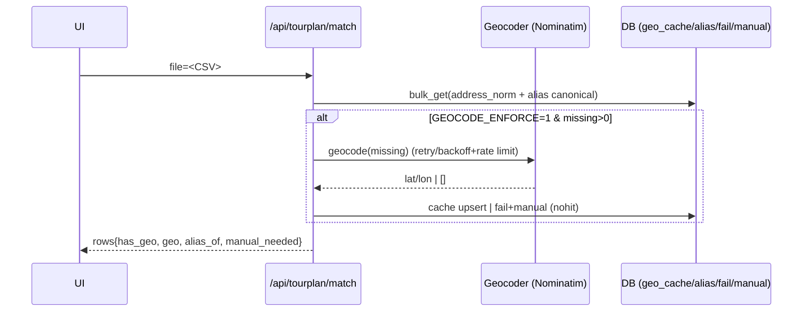

# FAMO TrafficApp – Architekturübersicht

Diese Architektur folgt dem in `docs/Neu/Neue Prompts.md` definierten 8‑Schritte-Prozess. Jeder Schritt bildet ein eigenständiges Modul mit klaren Ein- und Ausgaben. Die Module lassen sich einzeln testen, beobachten und versionieren.

---

## 1. Datenimport & Vorverarbeitung

- **Input**: Tourplan-CSV (`tourplaene/Tourenplan*.csv`) oder Upload via API.
- **Komponente**: `backend/parsers/tour_plan_parser.py` (`parse_tour_plan_to_dict`).
- **Aufgaben**:
  - Lesen semikolon-separierter Tourpläne (Latin1-Encoding).
  - Normalisieren deutscher Sonderzeichen (ä→ae, ö→oe, ü→ue, ß→ss).
  - BAR-Touren dem nachfolgenden Haupttourblock zuordnen.
  - Deduplizieren identischer Kunden (KdNr + Adresse).
- **Output**: `TourPlan`-Datensatz (`metadata`, `tours`, `customers`, `stats`).
- **Persistenz**: temporäre Datei im Upload-Verzeichnis (`data/uploads`).
- **Tests**: `scripts/test_csv_parser.py` prüft sämtliche CSV-Beispiele.

## 2. Geokodierung der Adressen

- **Input**: Kundenliste aus Schritt 1.
- **Komponenten**: `backend/services/geocode.py`, `geo_validator.py`.
- **Aufgaben**:
  - Adresse zusammenbauen (`street`, `postal_code`, `city`).
  - Geokoordinaten über Provider (z. B. OpenRouteService / Nominatim) ermitteln.
  - Ergebnisse in SQLite (`data/customers.db`, Tabelle `customers`/`geocache`) speichern, um wiederholte Anfragen zu vermeiden.
  - Fallback-Koordinaten per PLZ-Heuristik; Validierung (Bounding-Box, Geschäftsgebiet).
- **Output**: Kundenliste mit `lat`, `lon`, `geocoded`, `source` + persistiertem Cache-Eintrag.
- **Monitoring**: Logging in `logs/csv_import_debug.log`, Trefferquote / Fallback-Rate in Workflow-Stats.

## 3. Datenfluss & Encoding-Policy

**Ziele:** deterministische Verarbeitung, reproduzierbare Ergebnisse, keine stillen Korruptionen.

### 3.1 Quellen & Pfade

- **Originale (read-only):** `./Tourplaene/**` – werden nie verändert (aus `ORIG_DIR` env var).
- **Staging (UTF-8):** `./data/staging` – Kopie der CSV, *immer* UTF-8 (aus `STAGING_DIR`).
- **Output/Cache (DB):** `geo_cache`, `geo_alias`, `geo_fail`, `geo_manual`, `geo_audit`.

### 3.2 Encoding-Kontrakt

- **Lesen:** heuristisch `cp850` → `utf-8-sig` → `latin-1` (aus `env.example`: `IN_ENCODING=cp850`).
- **Schreiben/Export/Logs:** **immer UTF-8** (`encoding="utf-8"`, `PYTHONUTF8=1`, `PYTHONIOENCODING=utf-8`).

### 3.3 Normalisierung

- `normalize_addr()` aus `repositories/geo_repo.py`:
  - Unicode NFC Normalisierung
  - Whitespace-Bereinigung (Trim + Space-Collapse)
  - Einfache Abkürzungen (`str.` → `straße`, `pl.` → `platz`)
  - Keine destruktive Transliteration
  - Entfernt Excel-Apostrophen/Leerwerte; „Halle“-Zusätze und uneinheitliche „OT“-Schreibweisen werden geglättet

### 3.3.1 Synonym‑Resolver & DTO (neu)

- `common/synonyms.py` enthält feste PF/BAR‑Synonyme mit Koordinaten, plus `resolve_customer_number(name)`.
- `services/stop_dto.build_stop_dto(...)` liefert DTOs mit `resolved_address`, `geo_source` und Guard `valid`.
- Endpunkte verwenden für PF/BAR‑Treffer einen Short‑Circuit (kein externer Geocoder) und upserten die Werte in DB/Cache.

### 3.4 Verarbeitung (Sequenz)



### 3.5 Datenmodelle (Kern)

| Tabelle      | Spalten | Zweck |
|--------------|---------|-------|
| geo_cache    | address_norm (PK), lat, lon, source, by_user, updated_at | Geocoding-Cache |
| geo_alias    | address_norm (PK), canonical_norm, created_at, created_by | Alias-Auflösung |
| geo_fail     | address_norm (PK), reason, until, updated_at | Temporäre Sperre/Backoff |
| geo_manual   | address_norm (PK), reason, status, attempts, created_at, updated_at | Manuelle To-Dos |
| geo_audit    | id (PK), ts, action, query, canonical, by_user | Nachvollziehbarkeit |

### 3.6 Schnittstellen (Auszug)

| Endpoint                       | Zweck                                | Input                 | Output                                                |
| ------------------------------ | ------------------------------------ | --------------------- | ----------------------------------------------------- |
| `/api/tourplaene/list`         | CSVs auflisten                       | –                     | `{success, files:[{name,path,size,modified}], count}` |
| `/api/tourplan/match`          | Datei prüfen (Auto‑Geocode optional) | `file`                | `{file,rows,ok,warn,bad,items:[{row,customer_name,address,has_geo,geo,alias_of,manual_needed}]}` |
| `/api/tourplan/status`         | Counts                               | `file`                | `{file,total,cached,missing,marker_hits,examples_missing}` |
| `/api/tourplan/triage`         | E2E-Diagnose                         | `file,limit`          | `{file,count,items:[{raw,norm,alias_of,in_cache,via_alias,has_geo,geo,in_fail,manual_needed}]}` |
| `/api/tourplan/suggest`        | Fuzzy‑Vorschläge                     | `file,topk,threshold` | Kandidaten je fehlender Adresse                       |
| `/api/tourplan/suggest/accept` | Alias setzen                         | `query,accept`        | `{ok}`                                                |
| `/api/tourplan/manual-geo`     | manuelle Koords                      | `address,latitude,longitude,by_user` | `{ok}`                                                |
| `/api/tourplan/geocode-missing`| Re‑Geocode Batch                     | `file,limit,dry_run`  | `{file,requested,processed,items}`                    |

**Beispiel-Responses:**

```json
// GET /api/tourplaene/list
{
  "success": true,
  "files": [
    {
      "name": "Tourenplan 01.09.2025.csv",
      "path": "./tourplaene/Tourenplan 01.09.2025.csv",
      "size": 15420,
      "modified": 1693564800
    }
  ],
  "count": 1
}

// GET /api/tourplan/status?file=Tourenplan%2001.09.2025.csv
{
  "file": "./tourplaene/Tourenplan 01.09.2025.csv",
  "total": 25,
  "cached": 20,
  "missing": 5,
  "marker_hits": 0,
  "examples_missing": [
    "Musterstraße 1, 01234 Dresden",
    "Testweg 5, 01067 Leipzig"
  ]
}

// GET /api/tourplan/triage?file=Tourenplan%2001.09.2025.csv&limit=3
{
  "file": "./tourplaene/Tourenplan 01.09.2025.csv",
  "count": 3,
  "items": [
    {
      "raw": "Musterstraße 1, Dresden",
      "norm": "musterstraße 1, dresden",
      "alias_of": null,
      "in_cache": false,
      "via_alias": false,
      "has_geo": false,
      "geo": null,
      "in_fail": null,
      "manual_needed": true
    }
  ]
}
```

---

## 4. Leitplanken, SLOs & Betrieb

### 4.1 Governance (Do-Not-Touch)

- `./Tourplaene/**` **read-only** (Docker `:ro`, Pre-commit Blocker in `.pre-commit-config.yaml`).
- Änderungen an `ingest/reader.py` nur via PR mit Tests.
- Referenz auf `CURSOR_RULES.md` für Prompt-Governance.

### 4.2 SLOs (CI setzt Schwellen durch)

- **Erkennungsquote** (ok+warn)/rows ≥ **95%** (aus `tools/ci_slo_check.py`: `SLO_OK_RATE=0.95`).
- **Mojibake-Marker** = **0** (`BAD_MARKERS` aus `ingest/guards.py`).
- **Original-Integrität**: `tools/orig_integrity.py verify == ok`.
- **Fail-Rate/Lauf** < **2%**.

> Umsetzung: `tools/ci_slo_check.py` + Sentinel-Tests in `tests/test_encoding_sentinels.py`.

### 4.3 Robustheit

- **Retry/Backoff** (aus `services/geocode_fill.py`: `MAX_RETRIES=3`, `BASE_SLEEP=1.0`), **Rate-Limit** (`GEOCODER_RPS=1`).
- **Fail-Cache** (`db/schema_fail.py`), **Manual-Queue** (`db/schema_manual.py`).
- **Aliasse**/**Overrides** ohne CSV-Änderung – sofort wirksam.

### 4.4 Observability

- UTF-8-stabiles, ruhiges Logging (eine Status-Zeile pro Match in `routes/tourplan_status.py`).
- UI-Status-Polling; Inspector-Modals (Audit, Fail-Cache).
- `/api/tourplan/triage` zur Ursachenanalyse.

### 4.5 Runbooks (Kurzform)

- **Alles rot:** `/triage` prüfen; wenn `has_geo:true` → Frontend-Binding; sonst Cache/DB/ENV checken.
- **429/Timeouts:** Fail-Cache abwarten oder gezielt `clear`; `GEOCODE_BATCH_LIMIT` kleiner setzen.
- **Mojibake:** Sentinel-Tests/CI schlagen an → nur UTF-8-Writes erlaubt.
- **No-Hit:** Fuzzy-Vorschlag akzeptieren oder Manual-Geo setzen; Audit dokumentiert.

---

## 5. Reisezeit- & Distanzmatrix

- **Input**: Depotkoordinaten + Kunden aus Schritt 2.
- **Komponenten**: `backend/services/real_routing.py` (OpenRouteService), `backend/services/optimization_rules.py` (Geschwindigkeiten, Servicezeiten).
- **Aufgaben**:
  - Erzeugen symmetrischer Zeitmatrix (Depot ↔ Kunden, Kunde ↔ Kunde).
  - Ergänzen fester Servicezeit (Standard: 2 Minuten pro Halt).
  - Speichern der Matrix im Workflow-Kontext (In-Memory / Cache für Optimierung).
- **Output**: `time_matrix[index_a][index_b]` in Minuten + Distanzmatrix.
- **Anmerkung**: Bei fehlender Routing-API fallback auf Haversine (Offline-Modus) möglich.

## 6. Kundenclustering unter Zeitrestriktionen

- **Input**: Kunden + Zeitmatrix.
- **Komponenten**: `backend/services/multi_tour_generator.py` (Sweep-Heuristik + KI-Fallback), `optimization_rules.py` (Maximalwerte).
- **Geschäftsregeln**:
  - Max. 60 Minuten Fahrzeit bis zum letzten Kunden (inkl. Servicezeiten).
  - BAR-Kunden verbleiben in der zugehörigen Haupttour.
  - Tourstart/-ende: Depot FAMO Dresden.
- **Ablauf**:
  1. Sweep-Heuristik sortiert Kunden nach Polarwinkel.
  2. Zeitbudget wird sukzessive geprüft; überschreitet es 60 Minuten, startet neuer Cluster.
  3. KI-Optimierung kann alternative Cluster vorschlagen.
- **Output**: Liste von Tourgruppen (`GeneratedTour` Rohdaten ohne Reihenfolge oder geordnete Stoppfolgen je nach Modus).

## 7. Tourenreihenfolge optimieren (TSP)

- **Input**: Cluster aus Schritt 6.
- **Komponenten**: `backend/services/multi_tour_generator.py`, `AIOptimizer`, heuristische Verfahren (Nearest Neighbour, 2-Opt, KI).
- **Aufgaben**:
  - Reihenfolge der Stops pro Cluster minimieren (Zeit + Distanz).
  - Zeitbudget prüfen (Fahrzeit + Service + Rückfahrt).
  - Kennzahlen berechnen (Gesamtdauer, Distanz, Kosten).
- **Output**: `GeneratedTour` mit finaler Sequenz, Schätzungen, Constraint-Status, Optimierungsnotizen.

## 8. KI-Kommentare & Report

- **Input**: Optimierte Touren + Statistiken.
- **Komponenten**: `backend/services/ai_optimizer.py` (für reasoning), geplantes Modul `ai_commentary_service` (TODO, inkl. RAG/Vectorstore für Kontextwissen)
- **Aufgaben**:
  - Zusammenfassung jeder Tour in natürlicher Sprache (Begründung Reihenfolge, Verkehr, BAR-Hinweise).
  - Vergleich verschiedener Touren (Zeiteinsparungen, Clusterwechsel).
  - Logging & Prompt-Versionierung in `logs/` (zukünftig `ai_logs/`).
- **Output**: KI-Kommentare pro Tour + Gesamtbericht.

## 9. Frontend-Integration & Darstellung

- **Technologie**: React (geplant) + Leaflet; aktuelles MVP (`docs/Neu/famo_route_app/frontend/index.html`).
- **Layout-Vorgaben**:
  - **Rechte Seite (unter Karte)**: Liste aller Touren als Akkordeon (Tourtitel, z. B. `W-07:00 Uhr`), expandierbar via `+`.
  - **Linke Seitenleiste**: Filter (Datum, Tourtyp), Upload-Status.
  - BAR-Kunden farblich (orange) hervorheben.
  - Statistiken (Stops, Dauer, Distanz) je Tour + Gesamtübersicht.
- **Kommunikation**: REST Endpoints (`/api/parse-csv-tourplan`, `/api/csv-bulk-process`, `/api/csv-summary/{filename}`) + Websocket (geplant) für Live-Updates.

## 10. Tests, Logging & Prompt-Versionierung

- **Tests**:
  - Parser: `scripts/test_csv_parser.py` (Golden-File-Lauf über alle Tourpläne).
  - Services: pytest-Module (TODO) für Geocoding, Routing, Clustering.
  - End-to-End: Upload → Tourenliste → Export (geplant `tests/test_api_summary.py` Erweiterung).
- **Logging**:
  - CSV-Verarbeitung: `logs/csv_import_debug.log`.
  - AI-Interaktionen: geplanter Logger mit Prompt-/Response-Archiv.
  - Routing/Fehler: Standard FastAPI Logging + RotatingFileHandler.
- **Versionierung**:
  - Jeder Prompt erhält ID + Version; Speicherung mit Response für Audits.
  - Exportierte Touren (`routen/YYYY-MM-DD/`) werden signiert/gehasht (TODO).
- **Monitoring**:
  - Kontextinformationen zu Laufzeiten, Erfolgsquoten, Geocoding-Fallback-Rate.

---

## Datenfluss-Zusammenfassung

1. Nutzer lädt CSV hoch → Parser (Schritt 1).
2. Geokodierung ergänzt Koordinaten + Validierung (Schritt 2).
3. Encoding & Normalisierung (Schritt 3).
4. Leitplanken & SLOs prüfen (Schritt 4).
5. Routing erstellt Zeitmatrix (Schritt 5).
6. Clustering erzeugt Tourgruppen (Schritt 6).
7. TSP-Optimierung bestimmt Reihenfolge + Kennzahlen (Schritt 7).
8. KI generiert kommentierte Reports (Schritt 8).
9. Frontend zeigt Tourenliste + Karte + Kommentare (Schritt 9).
10. Tests & Logs sichern Qualität, Prompts werden versioniert (Schritt 10).

Jeder Schritt kann unabhängig deployt und observiert werden. Fehlerfälle (z. B. fehlende Geodaten, Zeitlimit überschritten) werden früh erkannt und mit Vorschlägen zur Korrektur an das Frontend gemeldet.