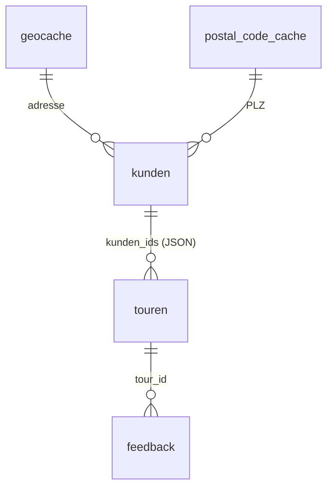

# 🗄️ FAMO TrafficApp - Datenbank Schema

## 📋 Übersicht

Die FAMO TrafficApp verwendet eine **SQLite-Datenbank** für die Speicherung aller Touren-, Kunden- und Geocoding-Daten. Das Schema ist optimiert für die spezifischen Anforderungen der Tourenplanung und -optimierung.

## 🏗️ Datenbankstruktur

### 📊 Tabellen-Übersicht

| Tabelle | Zweck | Hauptfunktion |
|---------|-------|---------------|
| `kunden` | Kundenstammdaten | Speichert alle Kunden mit Adressen und Koordinaten |
| `touren` | Tourenverwaltung | Haupttabelle für alle geplanten Touren |
| `feedback` | Fahrerfeedback | Bewertungen und Kommentare zu Touren |
| `geocache` | Geocoding-Cache | Zwischenspeicher für Adress-zu-Koordinaten |
| `postal_code_cache` | PLZ-Cache | Zwischenspeicher für Postleitzahlen |

---

## 👥 Tabelle: `kunden`

**Zweck:** Speichert alle Kundenstammdaten mit Adressen und geografischen Koordinaten.

### 📋 Spalten

| Spalte | Typ | Beschreibung | Constraints |
|--------|-----|--------------|-------------|
| `id` | `INTEGER` | Primärschlüssel | `PRIMARY KEY AUTOINCREMENT` |
| `name` | `TEXT` | Kundenname | `NOT NULL` |
| `adresse` | `TEXT` | Vollständige Adresse | `NOT NULL` |
| `lat` | `REAL` | Breitengrad | `NULL` erlaubt |
| `lon` | `REAL` | Längengrad | `NULL` erlaubt |
| `created_at` | `TEXT` | Erstellungsdatum | `DEFAULT (datetime('now'))` |

### 🔑 Indizes

```sql
-- Eindeutigkeit: gleicher Kunde (Name+Adresse) nur einmal
CREATE UNIQUE INDEX kunden_unique_name_addr
ON kunden(name COLLATE NOCASE, adresse COLLATE NOCASE);
```

### 📝 Beispiel-Daten

```sql
INSERT INTO kunden (name, adresse, lat, lon) VALUES
('FAMO Dresden', 'Stuttgarter Str. 33, 01189 Dresden', 51.0504, 13.7373),
('Kunde A', 'Hauptstr. 1, 01067 Dresden', 51.0521, 13.7372),
('Kunde B', 'Marktplatz 5, 01067 Dresden', 51.0519, 13.7375);
```

---

## 🚚 Tabelle: `touren`

**Zweck:** Haupttabelle für alle geplanten Touren mit Kunden-IDs und Metadaten.

### 📋 Spalten

| Spalte | Typ | Beschreibung | Constraints |
|--------|-----|--------------|-------------|
| `id` | `INTEGER` | Primärschlüssel | `PRIMARY KEY AUTOINCREMENT` |
| `tour_id` | `TEXT` | Tour-Identifikator (z.B. "W-07:00") | `NOT NULL` |
| `datum` | `TEXT` | Tour-Datum (YYYY-MM-DD) | `NOT NULL` |
| `kunden_ids` | `TEXT` | JSON-Liste der Kunden-IDs | `NULL` erlaubt |
| `dauer_min` | `INTEGER` | Geschätzte Dauer in Minuten | `NULL` erlaubt |
| `distanz_km` | `REAL` | Geschätzte Distanz in km | `NULL` erlaubt |
| `fahrer` | `TEXT` | Zugewiesener Fahrer | `NULL` erlaubt |
| `created_at` | `TEXT` | Erstellungsdatum | `DEFAULT (datetime('now'))` |

### 🔑 Indizes

```sql
-- Eindeutigkeit: gleiche Tour-ID am selben Datum nur einmal
CREATE UNIQUE INDEX touren_unique_by_date
ON touren(tour_id, datum);
```

### 📝 Beispiel-Daten

```sql
INSERT INTO touren (tour_id, datum, kunden_ids, dauer_min, distanz_km, fahrer) VALUES
('W-07:00', '2025-08-19', '[1,2,3,4,5]', 120, 45.5, 'Max Mustermann'),
('W-09:00', '2025-08-19', '[6,7,8,9,10]', 90, 32.1, 'Anna Schmidt'),
('PIR-14:00', '2025-08-19', '[11,12,13]', 60, 25.3, 'Peter Weber');
```

---

## 💬 Tabelle: `feedback`

**Zweck:** Speichert Fahrerfeedback und Bewertungen zu abgeschlossenen Touren.

### 📋 Spalten

| Spalte | Typ | Beschreibung | Constraints |
|--------|-----|--------------|-------------|
| `id` | `INTEGER` | Primärschlüssel | `PRIMARY KEY AUTOINCREMENT` |
| `tour_id` | `TEXT` | Tour-Identifikator | `NOT NULL` |
| `datum` | `TEXT` | Tour-Datum | `NOT NULL` |
| `kommentar` | `TEXT` | Fahrerkommentar | `NULL` erlaubt |
| `bewertung` | `INTEGER` | Bewertung (1-5 Sterne) | `NULL` erlaubt |
| `created_at` | `TEXT` | Erstellungsdatum | `DEFAULT (datetime('now'))` |

### 📝 Beispiel-Daten

```sql
INSERT INTO feedback (tour_id, datum, kommentar, bewertung) VALUES
('W-07:00', '2025-08-19', 'Alles gut gelaufen, keine Probleme', 5),
('W-09:00', '2025-08-19', 'Stau auf A4, 15 Min Verspätung', 3),
('PIR-14:00', '2025-08-19', 'Kunde nicht angetroffen', 2);
```

---

## 🗺️ Tabelle: `geocache`

**Zweck:** Zwischenspeicher für Geocoding-Ergebnisse zur Performance-Optimierung.

### 📋 Spalten

| Spalte | Typ | Beschreibung | Constraints |
|--------|-----|--------------|-------------|
| `adresse` | `TEXT` | Vollständige Adresse | `PRIMARY KEY` |
| `lat` | `REAL` | Breitengrad | `NOT NULL` |
| `lon` | `REAL` | Längengrad | `NOT NULL` |
| `updated_at` | `TEXT` | Letzte Aktualisierung | `DEFAULT (datetime('now'))` |

### 📝 Beispiel-Daten

```sql
INSERT INTO geocache (adresse, lat, lon) VALUES
('Stuttgarter Str. 33, 01189 Dresden', 51.0504, 13.7373),
('Hauptstr. 1, 01067 Dresden', 51.0521, 13.7372),
('Marktplatz 5, 01067 Dresden', 51.0519, 13.7375);
```

---

## 📮 Tabelle: `postal_code_cache`

**Zweck:** Zwischenspeicher für Postleitzahl-zu-Stadt-Zuordnungen.

### 📋 Spalten

| Spalte | Typ | Beschreibung | Constraints |
|--------|-----|--------------|-------------|
| `postal_code` | `TEXT` | Postleitzahl | `PRIMARY KEY` |
| `city` | `TEXT` | Stadtname | `NOT NULL` |
| `updated_at` | `TEXT` | Letzte Aktualisierung | `DEFAULT (datetime('now'))` |

### 📝 Beispiel-Daten

```sql
INSERT INTO postal_code_cache (postal_code, city) VALUES
('01189', 'Dresden'),
('01067', 'Dresden'),
('01069', 'Dresden'),
('01097', 'Dresden');
```

---

## 🔗 Beziehungen zwischen Tabellen



### 📋 Beziehungsdetails

1. **kunden → touren**: Eine Tour kann mehrere Kunden enthalten (über JSON-Array in `kunden_ids`)
2. **touren → feedback**: Eine Tour kann mehrere Feedback-Einträge haben
3. **geocache → kunden**: Adressen werden für Geocoding gecacht
4. **postal_code_cache → kunden**: PLZ werden für Validierung gecacht

---

## 🚀 Performance-Optimierungen

### 🔍 Wichtige Indizes

```sql
-- Kunden-Suche nach Name/Adresse
CREATE INDEX idx_kunden_name ON kunden(name);
CREATE INDEX idx_kunden_adresse ON kunden(adresse);

-- Touren-Suche nach Datum und Tour-ID
CREATE INDEX idx_touren_datum ON touren(datum);
CREATE INDEX idx_touren_tour_id ON touren(tour_id);

-- Feedback-Suche nach Tour
CREATE INDEX idx_feedback_tour_id ON feedback(tour_id);
CREATE INDEX idx_feedback_datum ON feedback(datum);
```

### ⚡ Query-Optimierungen

```sql
-- Häufige Abfragen
SELECT * FROM kunden WHERE name LIKE '%Mustermann%';
SELECT * FROM touren WHERE datum = '2025-08-19';
SELECT * FROM touren WHERE tour_id LIKE 'W-%';
SELECT COUNT(*) FROM kunden WHERE lat IS NOT NULL;
```

---

## 🔧 Wartung und Backup

### 📦 Backup-Strategie

```bash
# Vollständiges Backup
sqlite3 traffic.db ".backup backup_$(date +%Y%m%d_%H%M%S).db"

# Nur Schema
sqlite3 traffic.db ".schema" > schema_backup.sql

# Nur Daten
sqlite3 traffic.db ".dump" > data_backup.sql
```

### 🧹 Cleanup-Operationen

```sql
-- Alte Geocache-Einträge löschen (älter als 30 Tage)
DELETE FROM geocache WHERE updated_at < datetime('now', '-30 days');

-- Alte Feedback-Einträge löschen (älter als 1 Jahr)
DELETE FROM feedback WHERE created_at < datetime('now', '-1 year');

-- VACUUM für Speicher-Optimierung
VACUUM;
```

---

## 📊 Statistiken und Monitoring

### 📈 Wichtige Metriken

```sql
-- Anzahl Kunden mit/ohne Koordinaten
SELECT 
    COUNT(*) as total_kunden,
    COUNT(lat) as mit_koordinaten,
    COUNT(*) - COUNT(lat) as ohne_koordinaten
FROM kunden;

-- Touren pro Tag
SELECT 
    datum,
    COUNT(*) as anzahl_touren,
    SUM(JSON_ARRAY_LENGTH(kunden_ids)) as total_kunden
FROM touren 
GROUP BY datum 
ORDER BY datum DESC;

-- Durchschnittliche Tour-Dauer
SELECT 
    tour_id,
    AVG(dauer_min) as avg_dauer_min,
    AVG(distanz_km) as avg_distanz_km
FROM touren 
WHERE dauer_min IS NOT NULL 
GROUP BY tour_id;
```

---

## 🛠️ Entwicklung und Testing

### 🧪 Test-Daten generieren

```sql
-- Test-Kunden einfügen
INSERT INTO kunden (name, adresse, lat, lon) 
SELECT 
    'Test-Kunde ' || row_number() OVER (ORDER BY random()),
    'Teststr. ' || (row_number() OVER (ORDER BY random()) % 100) || ', 01067 Dresden',
    51.05 + (random() - 0.5) * 0.1,
    13.73 + (random() - 0.5) * 0.1
FROM (SELECT 1 UNION SELECT 2 UNION SELECT 3 UNION SELECT 4 UNION SELECT 5);
```

### 🔍 Schema-Validierung

```sql
-- Tabellen-Existenz prüfen
SELECT name FROM sqlite_master WHERE type='table';

-- Spalten-Informationen
PRAGMA table_info(kunden);
PRAGMA table_info(touren);
PRAGMA table_info(feedback);
PRAGMA table_info(geocache);
PRAGMA table_info(postal_code_cache);
```

---

## 📚 Weitere Dokumentation

- [API-Dokumentation](API_DOKUMENTATION.md)
- [Installationsanleitung](INSTALLATION_GUIDE.md)
- [Multi-Tour Generator](MULTI_TOUR_GENERATOR_README.md)
- [Technische Dokumentation](TECHNISCHE_DOKUMENTATION.md)

---

## 🔄 Changelog

| Version | Datum | Änderungen |
|---------|-------|------------|
| 1.0.0 | 2025-08-19 | Initiale Schema-Definition |
| 1.1.0 | 2025-08-19 | Geocache-Tabelle hinzugefügt |
| 1.2.0 | 2025-08-19 | PLZ-Cache-Tabelle hinzugefügt |

---

*Letzte Aktualisierung: 19. August 2025*
