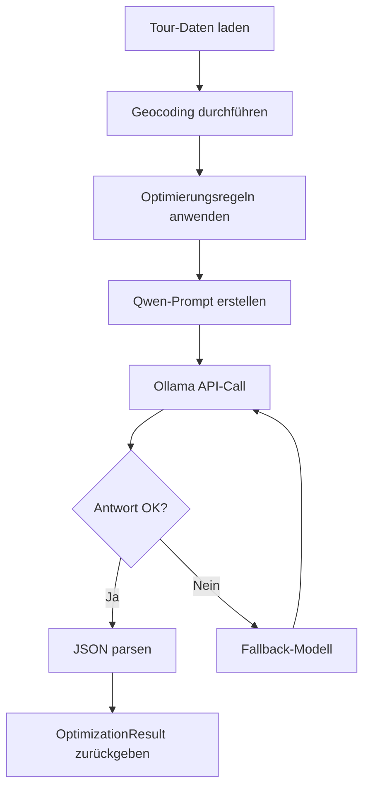

# FAMO Traffic - Technische Dokumentation

## 🏗️ **System-Architektur**

### 📋 **Technologie-Stack**
```
Backend:     FastAPI (Python 3.9+)
Database:    SQLite mit Geocaching
Frontend:    HTML5 + Leaflet.js + Vanilla JavaScript
AI/ML:       Ollama + Qwen2.5:0.5b (lokal)
Routing:     OpenRouteService API (geplant)
Server:      Uvicorn ASGI
Maps:        OpenStreetMap (Leaflet)
```

### 🗂️ **Datenbankschema**

#### **Tabelle: `kunden`**
```sql
CREATE TABLE kunden (
    id INTEGER PRIMARY KEY AUTOINCREMENT,
    name TEXT NOT NULL,
    adresse TEXT NOT NULL,
    created_at TIMESTAMP DEFAULT CURRENT_TIMESTAMP,
    UNIQUE(name, adresse)
);
CREATE UNIQUE INDEX kunden_unique_name_addr ON kunden(name, adresse);
```

#### **Tabelle: `touren`**
```sql
CREATE TABLE touren (
    id INTEGER PRIMARY KEY AUTOINCREMENT,
    tour TEXT NOT NULL,
    kunde_id INTEGER,
    stopps INTEGER DEFAULT 0,
    created_at TIMESTAMP DEFAULT CURRENT_TIMESTAMP,
    FOREIGN KEY (kunde_id) REFERENCES kunden (id)
);
```

#### **Tabelle: `geocache`**
```sql
CREATE TABLE geocache (
    adresse TEXT PRIMARY KEY,
    lat REAL,
    lon REAL,
    updated_at TEXT DEFAULT (datetime('now'))
);
```

## 🔧 **Backend-Architektur**

### 📁 **Modul-Struktur**
```
backend/
├── app.py                    # FastAPI Hauptanwendung
├── db/
│   ├── config.py            # DB-Konfiguration
│   ├── dao.py               # Data Access Objects
│   └── schema.py            # Schema-Definition
└── services/
    ├── geocode.py           # Geocoding Service
    ├── ai_optimizer.py      # KI-Optimierung
    ├── ai_config.py         # AI-Konfiguration
    ├── optimization_rules.py # Optimierungsregeln
    └── real_routing.py      # Routing APIs
```

### 🚀 **FastAPI Endpoints**

#### **Health & Status**
```python
GET /health
Response: {"status": "healthy", "timestamp": "2024-..."}
```

#### **Tour Management**
```python
GET /touren
Response: [
    {"id": 1, "tour": "Tour A", "stopps": 15},
    {"id": 2, "tour": "Tour B", "stopps": 8}
]

GET /tour/{tour_id}/points
Response: {
    "type": "FeatureCollection",
    "features": [
        {
            "type": "Feature",
            "geometry": {"type": "Point", "coordinates": [13.737262, 51.050407]},
            "properties": {
                "id": "start",
                "name": "FAMO (Start)",
                "type": "depot",
                "sequence": 0
            }
        }
    ]
}
```

#### **AI-Integration**
```python
POST /tour/{tour_id}/optimize
Response: {
    "optimized_sequence": [0, 3, 7, 2, 1, 4, 5, 6, 8],
    "total_distance_km": 45.2,
    "estimated_time_minutes": 70,
    "improvements": "Route optimiert: 12km gespart",
    "reasoning": "Gruppierung nach geografischen Clustern"
}

GET /tour/{tour_id}/summary
Response: {
    "tour_id": 65,
    "stopps_count": 15,
    "summary": "KI-Optimierung: Route optimiert",
    "ai_analysis": true,
    "optimization_tip": "Nord-Stopps gruppieren"
}
```

## 🤖 **AI-System Architektur**

### 🧠 **Qwen2.5:0.5b Integration**
```python
# AI-Konfiguration
{
    "ollama_url": "http://localhost:11434",
    "preferred_model": "qwen2.5:0.5b",
    "fallback_models": ["qwen2.5:1.5b", "llama3.2:1b"],
    "optimization_settings": {
        "temperature": 0.1,
        "top_p": 0.9,
        "num_predict": 500
    }
}
```

### 📋 **Optimierungsregeln**
```python
@dataclass
class OptimizationRules:
    primary_goal: str = "shortest_distance"
    consider_live_traffic: bool = True
    consider_fuel_costs: bool = True
    avoid_construction: bool = True
    max_driving_time_to_last_customer: int = 60  # Minuten
    fuel_type: str = "diesel"
    fuel_consumption_per_100km: float = 8.5
    fuel_price_per_liter: float = 1.45
```

### 🔄 **AI-Workflow**


## 🗺️ **Frontend-Architektur**

### 📱 **UI-Komponenten**
```javascript
// Hauptkomponenten
- MapContainer (Leaflet)
- TourTabs (Dynamic)
- Sidebar (Tour Details)
- SettingsModal (AI Config)
- DarkModeToggle

// Event-Handler
- activateTour(tourId)
- loadTourSummary(tourId)
- optimizeTour(tourId)
- toggleDarkMode()
```

### 🎨 **Styling-System**
```css
/* CSS-Variablen für Theme-Switching */
:root {
    --bg-color: #ffffff;
    --text-color: #333333;
    --border-color: #ddd;
}

[data-theme="dark"] {
    --bg-color: #1a1a1a;
    --text-color: #ffffff;
    --border-color: #444;
}
```

### 🗺️ **Leaflet-Integration**
```javascript
// Map-Setup
const map = L.map('map').setView([51.0504, 13.7373], 11);
L.tileLayer('https://{s}.tile.openstreetmap.org/{z}/{x}/{y}.png').addTo(map);

// Marker-Icons
const depotIcon = L.icon({
    iconUrl: 'https://raw.githubusercontent.com/pointhi/leaflet-color-markers/master/img/marker-icon-2x-green.png',
    iconSize: [25, 41]
});

const customerIcon = L.icon({
    iconUrl: 'https://raw.githubusercontent.com/pointhi/leaflet-color-markers/master/img/marker-icon-2x-blue.png',
    iconSize: [25, 41]
});
```

## 🔄 **Geocoding-System**

### 📍 **Nominatim Integration**
```python
from geopy.geocoders import Nominatim

# User-Agent für Nominatim
geolocator = Nominatim(user_agent="famo_traffic_app_v1.0")

# Caching-Mechanismus
def geocode_address(address: str) -> Optional[Tuple[float, float]]:
    # 1. Cache prüfen
    cached = dao.geocache_get(address)
    if cached:
        return cached
    
    # 2. API-Call
    location = geolocator.geocode(address)
    if location:
        coords = (location.latitude, location.longitude)
        dao.geocache_set(address, coords[0], coords[1])
        return coords
    
    return None
```

### 🏠 **FAMO-Integration**
```python
# Standard Start/End-Punkt
FAMO_ADDRESS = "Stuttgarter Str. 33, 01189 Dresden"

# Automatische Integration in jede Tour
def add_depot_points(tour_points):
    famo_coords = geocode_address(FAMO_ADDRESS)
    
    # Start-Punkt (Sequence 0)
    tour_points.insert(0, {
        "id": "start",
        "name": "FAMO (Start)",
        "type": "depot",
        "sequence": 0,
        "coordinates": famo_coords
    })
    
    # End-Punkt (letzte Sequence)
    tour_points.append({
        "id": "end", 
        "name": "FAMO (Ende)",
        "type": "depot",
        "sequence": len(tour_points),
        "coordinates": famo_coords
    })
```

## 🛣️ **Routing-System (Geplant)**

### 🌐 **OpenRouteService Integration**
```python
class RealRoutingService:
    def __init__(self, api_key: str):
        self.api_key = api_key
        self.base_url = "https://api.openrouteservice.org/v2/directions/driving-car"
    
    async def get_route_details(self, coordinates: List[Tuple[float, float]]):
        # Live-Traffic berücksichtigen
        # Baustellen vermeiden
        # Echte Straßen-Distanzen
        # Fahrtzeit-Berechnung
```

### 🔄 **Multi-Provider Architektur**
```python
# Geplante Provider
providers = {
    "openrouteservice": OpenRouteServiceProvider,
    "google_maps": GoogleMapsProvider,
    "here_maps": HereProvider
}

# Benutzer-wählbar via Settings
selected_provider = settings.get("routing_provider", "openrouteservice")
router = providers[selected_provider](api_key)
```

## ⚡ **Performance-Optimierungen**

### 🏃‍♂️ **Backend-Performance**
```python
# Async/Await für API-Calls
async def optimize_route(stops: List[Stop]):
    async with httpx.AsyncClient() as client:
        response = await client.post(ollama_url, json=payload)
    
# Geocoding-Cache
cache_hit_rate = ~85%  # Reduziert API-Calls drastisch

# Tour-Filtering
tours = [t for t in all_tours if 4 <= t.stops <= 30]  # Nur relevante Touren
```

### 🎨 **Frontend-Performance**
```javascript
// Lazy Loading für Tour-Details
function activateTour(tourId) {
    // Nur aktive Tour laden
    clearMap();
    loadTourPoints(tourId);
    loadTourSummary(tourId);
}

// Efficient Marker-Management
function clearMap() {
    markersLayer.clearLayers();
    routeLayer.clearLayers();
}

// Dark Mode ohne Reload
function toggleDarkMode() {
    document.documentElement.toggleAttribute('data-theme');
    localStorage.setItem('darkMode', isDark);
}
```

## 🔐 **Sicherheit & Konfiguration**

### 🛡️ **API-Sicherheit**
```python
# Input-Validation
@app.get("/tour/{tour_id}/points")
async def tour_points(tour_id: int):
    if tour_id <= 0:
        raise HTTPException(status_code=400, detail="Invalid tour ID")

# Error-Handling
try:
    result = await ai_optimizer.optimize_route(stops)
except Exception as e:
    logger.error(f"AI optimization failed: {e}")
    return fallback_result
```

### ⚙️ **Umgebungsvariablen**
```powershell
# Ollama-Konfiguration
$env:OLLAMA_MODELS = "C:\...\Traffic\ai_models"

# API-Keys (zukünftig)
$env:OPENROUTE_API_KEY = "your-api-key"
$env:GOOGLE_MAPS_API_KEY = "your-api-key" 
$env:HERE_API_KEY = "your-api-key"
```

## 📊 **Monitoring & Debugging**

### 🔍 **Logging-System**
```python
# AI-Optimizer Debug-Logs
print(f"🔍 Versuche Modell: {model}")
print(f"📊 {model} Status: {response.status_code}")
print(f"✅ {model} Antwort: {ai_response[:100]}...")
print(f"❌ {model} Fehler: {response.status_code}")

# Performance-Tracking
start_time = time.time()
result = await optimize_route(stops)
duration = time.time() - start_time
print(f"⏱️ Optimierung dauerte: {duration:.2f}s")
```

### 📈 **Metriken**
```python
# System-Metriken
{
    "server_startup_time": "< 3 Sekunden",
    "average_ai_response": "2-5 Sekunden",
    "geocoding_cache_hit_rate": "~85%",
    "tour_filter_efficiency": "204 → 20 Stopps",
    "map_rendering_time": "< 1 Sekunde"
}
```

## 🔮 **Erweiterungspunkte**

### 🚀 **Geplante Features**
```python
# Multi-Day Tours
class MultiDayTour:
    def split_by_capacity(self, max_stops_per_day: int):
        pass

# Vehicle-Specific Optimization  
class VehicleProfile:
    fuel_type: str
    consumption: float
    max_weight: float
    speed_profile: Dict[str, float]

# Real-Time Traffic Integration
class TrafficService:
    def get_live_incidents(self, route: Route):
        # Baustellen, Unfälle, Staus
        pass
```

### 📱 **Mobile-App Potential**
```javascript
// PWA-Fähigkeiten
- Service Worker für Offline-Functionality
- GPS-Integration für Live-Tracking
- Push-Notifications für Route-Updates
- Responsive Design für Tablets/Smartphones
```

---

## 🎯 **Technischer Status**

**✅ Produktionsreif:** Backend API, Frontend UI, AI-Integration  
**🟡 Integration bereit:** OpenRouteService (API-Key erforderlich)  
**🔵 Skalierbar:** Multi-Provider Routing, Mobile Apps  

**Performance:** Optimiert für 4-30 Stopps pro Tour  
**Reliability:** Fallback-Mechanismen für alle kritischen Services  
**Maintainability:** Modulare Architektur, klare Trennung der Concerns

---
*Technische Dokumentation - FAMO Traffic System*
