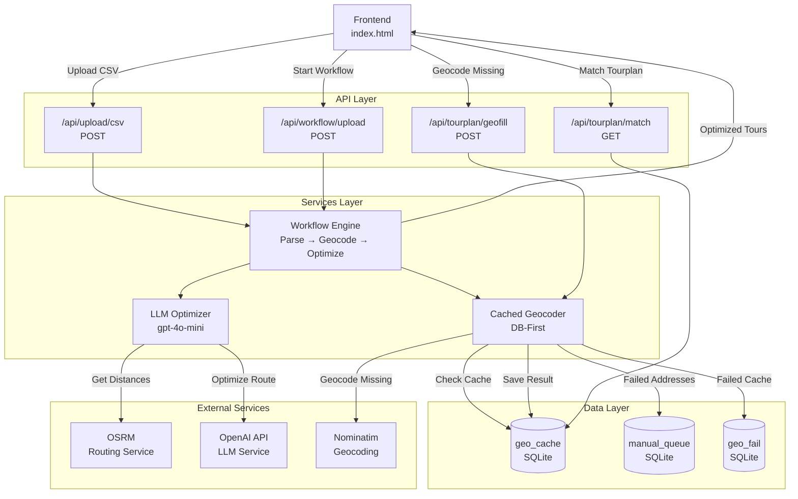

# Endpoint Flow - Datenfluss durch die Module

## Übersicht

Dieses Dokument zeigt grafisch, wie Daten durch die verschiedenen Module der FAMO TrafficApp fließen, von A nach B.

## Flow-Diagramm



## Module-Übersicht

### 1. Workflow API
**Beschreibung:** Kompletter Workflow: Parse → Geocode → Optimize

**Endpoints:**
- `POST /api/workflow/upload` - CSV-Upload + Workflow
- `POST /api/workflow/complete` - Workflow für Tourplaene-Datei
- `GET /api/workflow/status` - System-Status

**Abhängigkeiten:** Workflow Engine, Cached Geocoder, LLM Optimizer

### 2. Geocoding Services
**Beschreibung:** Adress-zu-Koordinaten Konvertierung

**Endpoints:**
- `GET /api/tourplan/match` - Tourplan gegen DB matchen
- `POST /api/tourplan/geofill` - Fehlende Koordinaten geokodieren
- `GET /api/address-recognition/status` - Erkennungsrate

**Abhängigkeiten:** geo_cache, Geocoder

### 3. Manual Queue
**Beschreibung:** Manuelle Adress-Korrektur

**Endpoints:**
- `GET /api/manual/list` - Offene Einträge
- `GET /api/manual/stats` - Statistiken
- `POST /api/manual/resolve` - Eintrag auflösen

**Abhängigkeiten:** manual_queue

### 4. System Status
**Beschreibung:** Health & Monitoring

**Endpoints:**
- `GET /health` - Server Health
- `GET /health/db` - Datenbank Status
- `GET /summary` - Zusammenfassung
- `GET /api/tests/status` - Test-Status

**Abhängigkeiten:** Keine

### 5. LLM Services
**Beschreibung:** AI-basierte Optimierung

**Endpoints:**
- `POST /api/llm/optimize` - Route optimieren
- `GET /api/llm/monitoring` - LLM-Monitoring
- `GET /api/llm/templates` - Prompt-Templates

**Abhängigkeiten:** OpenAI API, OSRM

## Typische Datenflüsse

### 1. CSV Upload → Workflow

```
Frontend: CSV hochladen
  → /api/workflow/upload (POST)
    → Workflow Engine: CSV parsen
      → Cached Geocoder: Adressen geokodieren
        → geo_cache: Koordinaten abfragen
        → Nominatim: Neue Adressen geokodieren (falls nicht in DB)
        → geo_cache: Ergebnis speichern
      → LLM Optimizer: Route optimieren
        → OSRM: Straßen-Distanzen holen
        → OpenAI API: Route optimieren
  → Frontend: Touren anzeigen
```

### 2. Tourplan Matching

```
Frontend: Tourplan auswählen
  → /api/tourplan/match (GET)
    → geo_cache: Adressen abgleichen
  → Frontend: Match-Ergebnisse
```

### 3. LLM-Routenoptimierung

```
Frontend: Route optimieren
  → /api/llm/optimize (POST)
    → LLM Optimizer
      → OSRM: Straßen-Distanzen holen
      → OpenAI API: Route optimieren
  → Frontend: Optimierte Route
```

## Datenbank-First Strategie

**Wichtig:** Der Workflow folgt einer "DB-First" Strategie:

1. **Koordinaten bereits vorhanden?** → Direkt verwenden
2. **In geo_cache gefunden?** → Aus DB laden
3. **Nicht in DB?** → Extern geokodieren und in DB speichern
4. **Beim nächsten Mal:** Direkt aus DB (Schritt 2)

**Regel:** Einmal geocodiert = immer aus DB (nicht anders)

## Service-Kommunikation

### Workflow Engine
- **Eingabe:** CSV-Content (Bytes)
- **Ausgabe:** WorkflowResult mit Touren
- **Kommuniziert mit:**
  - Cached Geocoder (für Adressen)
  - LLM Optimizer (für Routenoptimierung)

### Cached Geocoder
- **Eingabe:** TourStop (Adresse)
- **Ausgabe:** (lat, lon, error)
- **Kommuniziert mit:**
  - geo_cache (Datenbank-Abfrage)
  - Nominatim (externe Geocoding)
  - manual_queue (für fehlgeschlagene Adressen)

### LLM Optimizer
- **Eingabe:** Liste von Stops mit Koordinaten
- **Ausgabe:** Optimierte Route (Indizes)
- **Kommuniziert mit:**
  - OSRM (für Straßen-Distanzen)
  - OpenAI API (für Route-Optimierung)

## Externe Services

### OSRM (Open Source Routing Machine)
- **Zweck:** Straßen-Routing und Distanzberechnung
- **URL:** Konfiguriert über `OSRM_BASE_URL` (Standard: `http://localhost:5000`)
- **Verwendung:** Wird vom LLM Optimizer verwendet, um echte Straßen-Distanzen statt Luftlinie zu bekommen

### OpenAI API
- **Zweck:** AI-basierte Routenoptimierung
- **Model:** `gpt-4o-mini` (Standard)
- **Verwendung:** Optimiert die Reihenfolge von Stopps basierend auf OSRM-Distanzen

### Nominatim
- **Zweck:** Geocoding von Adressen
- **URL:** `https://nominatim.openstreetmap.org/search`
- **Verwendung:** Fallback, wenn Adresse nicht in geo_cache gefunden wird

